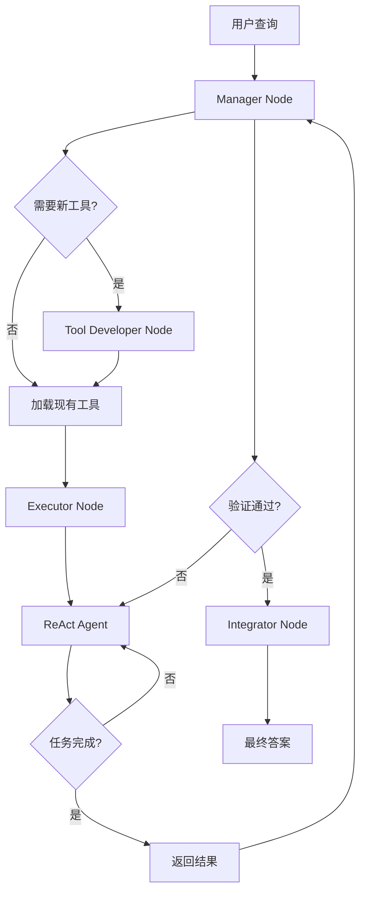

# 数据流与执行流程文档

## 1. 单任务执行流程

### 1.1 流程概览



### 1.2 详细步骤

#### 步骤 1: 任务初始化

**入口**: `src/main.py:42`

```python
async def run_task(user_input, run_dir, debug, task_id):
    # 1. 编译工作流图
    graph = builder.compile()
    
    # 2. 设置任务上下文
    token = task_id_context.set(task_id)
    
    # 3. 配置动态工具目录
    config = {
        "configurable": {
            "thread_id": task_id,
            "dynamic_tools_dir": f"{run_dir}/private_dynamic_tools/dynamic_tools_{task_id}",
            "dynamic_tools_public_dir": f"{run_dir}/dynamic_tools_public",
        }
    }
    
    # 4. 调用图执行
    final_state = await graph.ainvoke(input=initial_state, config=config)
```

#### 步骤 2: Manager Node 分析

**文件**: `src/core/nodes.py:97`

**输入**:
- `user_query`: 用户查询字符串
- `task_execution_context`: 任务执行上下文（首次为空）
- `pending_step_response`: 上一步执行结果（首次为空）
- `task_execution_count`: 执行计数

**处理逻辑**:

```python
# 1. 检查是否超过最大执行次数
if current_task_execution_cnt >= max_task_execution_cnt:
    return Command(update=..., goto="integrator")

# 2. 分析上一步执行结果
if pending_responses and not recur_limit_exceeded:
    analyze_tasks.append(analyze_response(pending_responses))

# 3. 如果验证通过，跳转到 Integrator
if check_pass:
    return Command(goto="integrator")

# 4. 分析任务工具需求
required_tool_names, tool_usage_guidance, tool_requests = await analyze_task_tools(
    user_query, dynamic_tools_private_dir, dynamic_tools_public_dir, failure_report
)

# 5. 跳转到 Tool Developer
return Command(update=..., goto="tool_developer")
```

**输出**:
- `required_tool_names`: 需要加载的工具名称列表
- `tool_usage_guidance`: 工具使用指导
- `pending_tool_requests`: 需要新建的工具请求列表

#### 步骤 3: Tool Developer Node

**文件**: `src/core/nodes.py:279`

**场景 A: 无需新建工具**

```python
if not pending_tool_requests:
    bound_tools = await filter_tools_by_names(
        required_tool_names, 
        dynamic_tools_private_dir, 
        dynamic_tools_public_dir, 
        user_query
    )
    task_execution_context.bound_tools = bound_tools
    return Command(update=..., goto="executor")
```

**场景 B: 需要新建工具**

```python
# 1. 并发构建所有工具
build_tasks = [
    _build_single_tool(tool_req, idx, total_tools, dynamic_tools_dir)
    for idx, tool_req in enumerate(pending_tool_requests)
]
results = await asyncio.gather(*build_tasks)

# 2. 处理构建结果
successful_tools = []
failed_tools = []
for result in results:
    if result["success"]:
        successful_tools.append(result)
    else:
        failed_tools.append(result)

# 3. 如果有工具构建失败，直接结束任务
if failed_tools:
    return Command(goto="integrator")

# 4. 更新工具列表并跳转到 Executor
bound_tools = await filter_tools_by_names(...)
return Command(update=..., goto="executor")
```

**工具构建流程** (`_build_single_tool`):

```python
async def _build_single_tool(tool_req, tool_index, total, dynamic_tools_dir):
    # 1. 生成唯一文件名
    safe_name = re.sub(r"[^a-zA-Z0-9_]+", "_", tool_name).strip("_")
    tool_filename = os.path.join(dynamic_tools_dir, f"{safe_name}.py")
    
    # 2. 调用 Codex 生成代码（最多 3 次重试）
    for attempt in range(1, max_retries + 1):
        builder_prompt = prompt_loader.get_prompt("toolsmiths_agent.md", ...)
        code, build_success = await call_codex_exec(builder_prompt, tool_filename)
        
        if build_success and os.path.exists(tool_filename):
            return {"success": True, "tool_filename": tool_filename}
    
    return {"success": False}
```

#### 步骤 4: Executor Node

**文件**: `src/core/nodes.py:370`

**流程**:

```python
async def executor_node(state: State, config: RunnableConfig):
    # 1. 准备 ReAct Agent 输入
    agent_input = {
        "messages": [HumanMessage(content=task_info)],
        "user_query": user_query,
    }
    
    # 2. 创建 ReAct Agent
    agent = ReActAgent(
        llm=create_llm(LLMType.BASIC),
        tools=bound_tools,
        max_steps=default_recursion_limit,
        tool_enhance_interval=tool_enhance_interval,
        ...
    )
    
    # 3. 流式执行
    all_messages = []
    recur_limit_exceeded = False
    async for stream_state in agent.astream(...):
        if stream_state.get("tool_steps", 0) >= agent.max_steps:
            recur_limit_exceeded = True
        all_messages = list(stream_state.get("messages", []))
    
    # 4. 提取工具执行记录
    new_tool_executions = extract_tool_calls_from_messages(all_messages)
    
    # 5. 生成上下文摘要（如果达到递归限制）
    if recur_limit_exceeded:
        context_summary = await summarize_context(...)
        pending_responses = context_summary
    else:
        pending_responses = last_message.content
    
    # 6. 返回 Manager Node
    return Command(
        update={
            "pending_step_response": pending_responses,
            "current_successful_tools": new_tool_executions,
            "task_execution_count": state.get("task_execution_count", 0) + 1,
        },
        goto="manager"
    )
```

#### 步骤 5: ReAct Agent 内部流程

**文件**: `src/agents/react.py:48`

**节点状态图**:

```
START
  │
  ▼
┌─────────┐
│  agent  │◄────────────────┐
└────┬────┘                  │
     │                       │
     ▼                       │
┌─────────────┐              │
│ should_continue│            │
└──────┬──────┘              │
       │                     │
   ┌───┴───┐                 │
   ▼       ▼                 │
┌──────┐ ┌──────┐            │
│ tools│ │ END  │            │
└──┬───┘ └──────┘            │
   │                         │
   ▼                         │
┌─────────────┐              │
│ need_enhance │              │
└──────┬──────┘              │
       │                     │
   ┌───┴────────┐            │
   ▼            ▼            │
┌──────────┐ ┌──────────┐    │
│enhance_  │ │context_  │    │
│  tools   │ │ summary  │────┘
└──────────┘ └──────────┘
```

**详细流程**:

1. **Agent Node** (`call_model`):
   - 添加系统提示词（来自 `worker.md`）
   - 调用 LLM 生成响应
   - 检查是否达到递归限制

2. **Should Continue** (`should_continue`):
   ```python
   def should_continue(state: AgentState) -> Literal["tools", "rollback", END]:
       # 1. 检查重试次数
       if retry_count >= max_retries:
           return END
       
       # 2. 检查响应是否为空
       if is_response_empty(last_message):
           return "rollback"
       
       # 3. 检查是否有工具调用
       if last_message.tool_calls:
           if tool_steps >= max_steps:
               return END
           return "tools"
       
       # 4. 任务完成，执行最终工具增强
       asyncio.run(enhance_tools(...))
       return END
   ```

3. **Tools Node** (`call_tools`):
   - 执行工具调用
   - 增加 tool_steps 计数

4. **Need Enhance** (`need_enhance`):
   ```python
   def need_enhance(self, state):
       tool_steps = state.get("tool_steps", 0)
       # 每 tool_enhance_interval 步执行一次增强
       if tool_steps % self.tool_enhance_interval == 0:
           return "enhance_tools"
       return "context_summary"
   ```

5. **Enhance Tools** (`enhance_tools` 方法）:
   ```python
   def enhance_tools(self, state: AgentState):
       # 1. 分析历史执行记录
       # 2. 识别需要增强的工具
       # 3. 调用 Codex 生成增强版本
       # 4. 重新绑定工具到 LLM
       # 5. 更新消息历史（移除失败的工具调用）
   ```

6. **Context Summary** (`context_summary_internal`):
   - 检查 Token 使用量
   - 如果超限，截断历史消息

7. **Rollback** (`rollback`):
   ```python
   def rollback(self, state: AgentState):
       # 1. 找到倒数第二个 AIMessage
       # 2. 移除该消息及其后续所有消息
       # 3. 减少 tool_steps（如果有 ToolMessage 被移除）
       # 4. 增加 retry_count
   ```

#### 步骤 6: 工具增强流程

**文件**: `src/agents/react.py:287`

```python
async def enhance_tools(origin_messages, dynamic_tools_dir, dynamic_tools_public_dir, user_query, tools):
    # 1. 提取工具执行记录
    tool_executions = extract_tool_calls_from_messages(origin_messages)
    
    # 2. 过滤未验证成功的工具
    tool_executions_to_analyze = [
        te for te in tool_executions 
        if te.tool_name not in success_tool_names
    ]
    
    # 3. 并发分析每个工具的执行结果
    messages = [...]  # 构建分析提示词
    tool_analyze_tasks = [tool_analyze_llm.ainvoke([message]) for message in messages]
    tool_analyze_results = await asyncio.gather(*tool_analyze_tasks)
    
    # 4. 分类执行结果
    need_enhancement_tools = []   # 需要增强的工具
    input_model_error_tools = []  # 输入错误的工具
    success_tools = []            # 成功的工具
    
    for te, result in zip(tool_executions_to_analyze, tool_analyze_results):
        if result == "Input Error":
            input_model_error_tools.append(te)
        elif result == "Execution Failure":
            need_enhancement_tools.append(te)
        elif result == "Success":
            success_tools.append(te)
    
    # 5. 更新成功工具集合
    success_tool_names.update([te.tool_name for te in success_tools])
    
    # 6. 增强失败的工具
    if need_enhancement_tools:
        for tool_name, tool_executions in historical_tool_executions.items():
            # 调用 Codex 生成增强版本
            codex_results = await asyncio.gather(*codex_tasks)
            # 重新加载增强后的工具
            enhanced_tools = await filter_tools_by_names(...)
    
    # 7. 更新消息历史（移除失败的工具调用）
    new_messages = []
    for message in origin_messages:
        if isinstance(message, ToolMessage) and message.id in enhanced_tool_messages_id:
            continue
        # ... 处理 AIMessage 的 tool_calls
        new_messages.append(message)
    
    return enhanced_tools, new_messages
```

#### 步骤 7: Integrator Node 整合

**文件**: `src/core/nodes.py:43`

```python
async def integrator_node(state: State, config: RunnableConfig):
    # 1. 准备系统提示词
    system_prompt = prompt_loader.get_prompt("give_answer.md", user_query=user_query)
    
    # 2. 准备观察消息（执行结果）
    observation_messages = [HumanMessage(content=execution_res)]
    
    # 3. 上下文截断
    compressed_state = ContextTrimmer(llm_token_limit).trim({"messages": observation_messages})
    
    # 4. 调用 LLM 生成结构化答案
    integrator_llm = create_llm(LLMType.BASIC).with_structured_output(GiveAnswerResponse)
    structured_payload = await integrator_llm.ainvoke(invoke_messages)
    
    # 5. 返回最终答案
    return {"final_answer": json.dumps({
        "final_answer": structured_payload.final_answer,
        "reasoning_summary": structured_payload.reasoning_summary,
    })}
```

#### 步骤 8: 任务完成清理

**文件**: `src/main.py:92-96`

```python
# 清理未成功的工具
private_dynamic_tools_dir = Path(config["configurable"]["dynamic_tools_dir"])
private_dynamic_tools_files = list(private_dynamic_tools_dir.glob("*.py"))
for file in private_dynamic_tools_files:
    if os.path.basename(file).split(".")[0] not in success_tool_names:
        os.remove(file)  # 删除未验证成功的工具
```

## 2. 批处理训练流程

### 2.1 流程概览

**入口**: `evolve.py:302`

```python
async def train(data_iter, train_steps, start, run_dir, prediction_file, timeout, merge_policy):
    for data in data_iter:
        # 1. 获取 batch 数据
        data_items = data["data_items"]
        task_ids = [item["task_id"] for item in data_items]
        
        # 2. 并行执行 batch 任务
        results = await run_batch_tasks(data_items, timeout)
        
        # 3. 保存结果
        save_predictions(results, prediction_file)
        
        # 4. 优化工具库
        await optimize_tools(active_task_ids, step, run_dir, merge_policy)
        
        step += 1
```

### 2.2 并行任务执行

**文件**: `evolve.py:276-370`

```python
def run_task_process(query, run_dir, task_id, timeout):
    """在独立进程中运行单个任务"""
    async def run_with_timeout():
        return await asyncio.wait_for(
            run_task(query, run_dir, task_id=task_id),
            timeout=timeout
        )
    return asyncio.run(run_with_timeout())

# 使用 multiprocessing 并行执行
with multiprocessing.Pool(processes=len(data_items)) as pool:
    async_jobs = [pool.apply_async(run_task_process, args) for args in process_args]
    
    # 轮询等待结果
    while pending and time.time() < deadline:
        for idx in list(pending):
            if async_jobs[idx].ready():
                results[idx] = async_jobs[idx].get()
                pending.discard(idx)
    
    # 处理超时任务
    for idx in pending:
        results[idx] = {"error": f"Timeout after {timeout} seconds"}
        timed_out_task_ids.add(task_ids[idx])
        pool.terminate()
```

### 2.3 工具优化流程

**文件**: `evolve.py:155-273`

```python
async def optimize_tools(task_ids, step, run_dir, merge_policy):
    # 1. 收集所有工具文件
    dynamic_tools_dirs = [f"{run_dir}/private_dynamic_tools/dynamic_tools_{task_id}" 
                          for task_id in task_ids]
    dynamic_tools_dirs.append(f"{run_dir}/dynamic_tools_public")
    
    # 2. 提取工具元数据
    tool_meta_list = []
    for file in all_python_files:
        extraction_success, tool_info, _ = extract_tool_info(file)
        if extraction_success:
            tool_meta_list.append({
                "name": file.stem,
                "description": tool_info["tool_description"],
                "input_schema_code": tool_info["input_schema_code"],
            })
    
    # 3. 工具聚类
    tool_clusters = cluster_tools(tool_meta_list)
    # 返回格式: [{"suggested_master_tool_name": "...", "tool_names": ["..."]}, ...]
    
    # 4. 合并工具
    tool_clusters_to_merge = [c for c in tool_clusters if len(c["tool_names"]) > 1]
    
    if merge_policy == "naive":
        # 选择文件最小的版本作为代表
        results = await asyncio.gather(*[
            naive_merge_tools(cluster, public_tool_dir) 
            for cluster in tool_clusters_to_merge
        ])
    else:
        # 使用 LLM 智能合并
        results = await asyncio.gather(*[
            merge_tools(cluster, public_tool_dir) 
            for cluster in llm_merge_candidates
        ])
    
    # 5. 复制唯一工具
    unique_tool_names = [c["tool_names"][0] for c in tool_clusters if len(c["tool_names"]) == 1]
    for tool_name in unique_tool_names:
        shutil.copy(f"{tool_name}.py", f"{public_tool_dir}/{base_name}.py")
```

### 2.4 工具聚类策略

**智能聚类**: `evolve.py:50-65`

```python
def cluster_tools(tool_meta_list: List[dict]):
    # 使用 LLM 分析工具功能相似性
    tool_cluster_llm = create_llm(LLMType.CLUSTER).with_structured_output(
        ToolClusterResponse, method="json_mode"
    )
    
    prompt = prompt_loader.get_prompt("tool_cluster.md", available_tools=tool_meta_list)
    response = tool_cluster_llm.invoke([HumanMessage(content=prompt)])
    
    return [cluster.model_dump() for cluster in response.consolidated_tool_clusters]
```

**朴素聚类**: `evolve.py:68-83`

```python
def naive_cluster_tools(tool_meta_list: List[dict]):
    tool_clusters = {}
    for tool_meta in tool_meta_list:
        tool_name = tool_meta.get("name")
        # 去除版本后缀（如 _01, _02）
        base_name = re.sub(r"(_(d+))+$", "", tool_name)
        
        if base_name not in tool_clusters:
            tool_clusters[base_name] = []
        tool_clusters[base_name].append(tool_name)
    
    return [{"suggested_master_tool_name": k, "tool_names": v} 
            for k, v in tool_clusters.items()]
```

## 3. 工具生命周期

### 3.1 状态流转

```
┌─────────────┐
│   创建中    │  ← Codex 生成代码
└──────┬──────┘
       │
       ▼
┌─────────────┐
│   验证中    │  ← 提取元数据、安装依赖
└──────┬──────┘
       │
       ▼
┌─────────────┐     ┌─────────────┐
│   私有库    │────▶│   增强中    │  ← 执行失败时
│  (Private)  │     └──────┬──────┘
└──────┬──────┘            │
       │                   ▼
       │            ┌─────────────┐
       │            │   增强后    │  ← Codex 生成新版本
       │            └──────┬──────┘
       │                   │
       │                   └──────┐
       │                          ▼
       │                   ┌─────────────┐
       │                   │   验证中    │
       │                   └──────┬──────┘
       │                          │
       ▼                          ▼
┌─────────────┐            ┌─────────────┐
│   公共库    │◄───────────│   废弃      │  ← 多次增强失败
│  (Public)   │   验证成功  └─────────────┘
└─────────────┘
       │
       ▼
┌─────────────┐
│   合并优化  │  ← Batch 结束时聚类合并
└──────┬──────┘
       │
       ▼
┌─────────────┐
│   通用工具  │
└─────────────┘
```

### 3.2 工具元数据结构

每个动态工具文件必须包含以下元数据:

```python
__TOOL_META__ = {
    "name": "tool_name",           # 工具名称
    "description": "...",          # 工具描述
    "dependencies": ["requests"],  # 依赖包列表
}

class InputModel(BaseModel):
    """输入参数模型"""
    param1: str
    param2: int = 10

def run(input_model: InputModel) -> OutputModel:
    """工具执行函数"""
    # ... 执行逻辑
    return OutputModel(result=...)
```

## 4. 错误处理与恢复

### 4.1 错误分类

| 错误类型 | 发生阶段 | 处理策略 |
|---------|---------|---------|
| **Input Error** | 工具执行 | 记录错误，尝试修复输入参数 |
| **Execution Failure** | 工具执行 | 标记工具待增强，调用 Codex 修复 |
| **Timeout** | 工具执行 | 终止执行，清理资源 |
| **Empty Response** | LLM 推理 | 回滚到上一步，重试 |
| **Tool Build Failure** | 工具生成 | 重试 3 次，失败后结束任务 |
| **Recur Limit** | ReAct 循环 | 生成上下文摘要，提交给 Manager |

### 4.2 恢复机制

1. **工具级别恢复**:
   ```python
   # 增强工具时最多重试 3 次
   for retry_num in range(3):
       code, success = await call_codex_exec(prompt, filename)
       if success:
           success, results = generate_and_run_tests(filename, records)
           if success:
               break
           else:
               # 使用失败的测试结果作为下一轮输入
               historical_call_records = results
   ```

2. **任务级别恢复**:
   ```python
   # Manager Node 处理失败
   if not check_pass:
       if current_task_execution_cnt >= max_task_execution_cnt:
           # 超过最大重试次数，强制结束
           return Command(goto="integrator")
       else:
           # 生成失败报告，重试
           return Command(update={"task_failure_report": suggestions}, goto="tool_developer")
   ```

3. **批处理级别恢复**:
   ```python
   # 单个任务超时不影响其他任务
   if task_timed_out:
       shutil.rmtree(private_tool_dir, ignore_errors=True)  # 清理资源
       continue  # 继续处理下一个任务
   ```

## 5. 性能优化点

### 5.1 并发优化

1. **并发工具构建**:
   ```python
   build_tasks = [_build_single_tool(...) for ...]
   results = await asyncio.gather(*build_tasks)
   ```

2. **并发工具分析**:
   ```python
   tool_analyze_tasks = [tool_analyze_llm.ainvoke([message]) for ...]
   tool_analyze_results = await asyncio.gather(*tool_analyze_tasks)
   ```

3. **并行批处理**:
   ```python
   with multiprocessing.Pool(processes=len(data_items)) as pool:
       async_jobs = [pool.apply_async(run_task_process, args) for ...]
   ```

### 5.2 缓存机制

1. **工具缓存**:
   ```python
   _dynamic_tools_cache: Dict[str, tuple[float, Any]] = {}
   # 键: 文件路径, 值: (修改时间, 工具对象)
   ```

2. **配置缓存**:
   ```python
   @lru_cache(maxsize=1)
   def get_full_config() -> Dict[str, Any]:
       return load_yaml_config(config_path)
   ```

### 5.3 响应截断

1. **Token 统计**:
   ```python
   def count_text_tokens(text: str) -> int:
       encoder = tiktoken.get_encoding("cl100k_base")
       return len(encoder.encode(text, allowed_special="all"))
   ```

2. **智能截断**:
   ```python
   def truncate_response_by_tokens(response, max_tokens, user_query):
       # 1. 尝试使用 LLM 摘要
       summarized = summarize_response_with_llm(response, ...)
       if summarized:
           return summarized
       
       # 2. 回退到启发式截断
       return truncate_response_locally(response, max_tokens)
   ```

---

*文档版本: 1.0*  
*最后更新: 2026-02-01*
